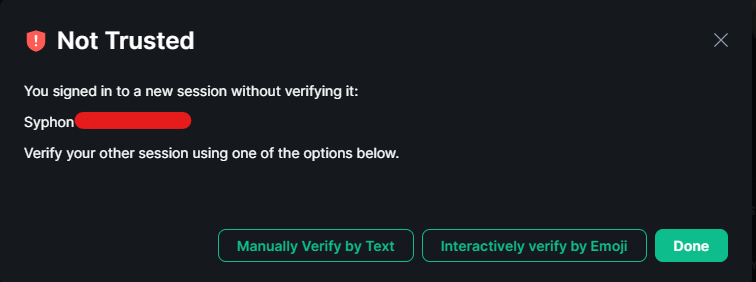

# Syphon FAQ

## Where is [X] feature?

Syphon is currently in early development. Whilst we believe the code to be of a standard where we can share with a wider userbase, Syphon does not rely on public Matrix libraries, instead coding against [the Matrix specification](https://spec.matrix.org/latest/).
  
This means that Syphon is currently missing features found in other Matrix chat clients as the development team work to implement them.

[Syphon's feature roadmap can be found here](https://syphon.org/roadmap).

## [X] feature is acting strange/my settings aren't saved

Syphon is currently in open alpha, meaning development is currently rapid so each release consists of quite a "jump" in features.
  
In the first instance, if you've updated your client and are experiencing "weird" behaviour, please **uninstall** your local version and **clean install** the app with its latest version to ensure any local settings files are recreated at their latest settings.
  
If you're still encountering errors or weird behaviour, you've probably encountered a bug so please ask for help!

## How do I...

### ...Verify my session?

The option to manually/non-interactively verify sessions has been "hidden" in recent Element client releases.

In order to cross-sign/verify your Syphon session, with the Element client:

1. Open any chat you're in - though to make your life easier the smaller the better
1. Click the  button in the top-right to show room information
1. Click 
1. Click on your name (if you're in a large room, you may have to search)
1. Click on the untrusted session 
1. Click "Manually Verify By Text" 

n.b. Interactive cross-signing is roadmapped as part of the `0.3.0` release

### ...Get Notifications?

Notifications are currently **Android-Only**.
  
Like most features in Syphon, notifications are disabled by default.

### ...Send Read Receipts?

Like most features in Syphon, Read Receipts are disabled by default and must be enabled in the Settings.