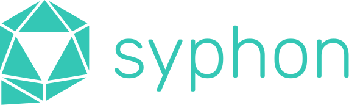
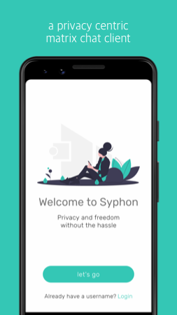
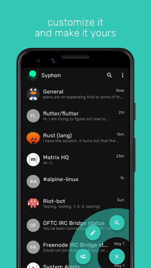

<br>

<p align='center'>

</p>

<p align='center'>
a privacy centric matrix client - now in open alpha*
</p>
 
<p align='center'>
    <a href='https://play.google.com/store/apps/details?id=org.tether.tether'>
        
    </a>
    <a href='https://apps.apple.com/us/app/syphon/id1496285352'>
        
    </a>
</p>

<br>

<p align='center'>


 

</p>

<p align='center'> 
    
    
     
</p>

<p align='center'>
 Syphon is still in alpha and we <b>do not recommend</b><br> 
 using it where proven and independently verified security is required.
</p>
<br>

## why

**Syphon aims to be built on the foundations of privacy, branding, and user experience** 
<br>in an effort to pull others away from proprietary chat clients to the matrix protocol.

We need to decentralize the web, but also provide a means of freedom within that system. Matrix has the potential to be a standardized peer-to-peer chat protocol, [and in a way already is,](https://matrix.org/blog/2020/06/02/introducing-p-2-p-matrix) that will allow people to communicate and transfer their data at will. Email has been standardized this way for a long time, as you can always email someone regardless of their provider. Most popular proprietary chat clients do not adhere to a publically available protocol and have too much control over users data.

Additionally, if the goal for Matrix is adoption to make instant messaging communication go the way of email, a network effect is required for this paradigm shift. Syphon makes the bet that the best way to attract new users is through strong branding and user experience. I hope that contributing and maintaining Syphon will help kick start this process and help those in need. 

Syphon will always be a not for profit, community driven application.

## features
- no analytics. period.
- no proprietary third party services
    - iOS will have APNS support, but will be made clear to the user
- all data is AES-256 encrypted at rest
- E2EE for direct chats using [Olm/Megolm](https://gitlab.matrix.org/matrix-org/olm)
    - group chats will be supported in the coming weeks
- all indicators of presence are opt-in only (typing indicators, read receipts, etc)
- customize themes and colors throughout the app

## goals
- [ ] desktop clients meet parity with mobile
- [ ] screen lock and pin protected cache features
- [ ] P2P messaging through a locally run server on the client
- [ ] allow transfering user data from one homeserver to another, or from local to remote servers 
- [ ] cli client using ncurses and the same redux store contained here (common)

## getting started
You may notice Syphon does not look very dart-y (for example, no \_private variable declarations, or using redux instead of provider) in an effort to reduce the learning curve from other languages or platforms. The faster one can get people contributing, the easier it will be for others to maintain or oversee a tool that does not exploit the user.

### environment
- you'll to do several things to setup the environment for Syphon
    - install flutter
    - install android studio
    - install cmake version 3.10.2 - (for olm/megolm)
        - [macos](https://cmake.org/files/v3.10/cmake-3.10.2-Darwin-x86_64.dmg) 
        - [linux](https://cmake.org/files/v3.10/cmake-3.10.2-Linux-x86_64.sh)
    - install libs needed for cmake
        - macos
            - ```brew install ninja```
        - linux
            - ```sudo apt install ninja-build```
    - clone repo and init submodules
        - ```git submodule update --init --recursive```
    - run the following prebuild commands
        - ```flutter pub get```
        - ```flutter pub run build_runner build```

### store
- State (redux)
- State Cache (redux_persist + Hive) 
- Cold Storage (Hive)

### state
- [Redux vs. Bloc](https://github.com/ereio/state)
- [Redux Tutorial](https://www.netguru.com/codestories/-implement-redux-with-flutter-app)
- [Redux Examples](https://github.com/brianegan/flutter_architecture_samples/blob/master/firestore_redux/)

### cold storage
- [Hive](https://github.com/hivedb/hive)

### local notifications (android only)
- utitlizes [android_alarm_manager](https://pub.dev/packages?q=background_alarm_manager) on Android to run the matrix /sync requests in a background thread and display notifications with [flutter_local_notifications](https://pub.dev/packages/flutter_local_notifications)
- no third party notification provider will ever be used outside Apples APNS for iOS only

### quirks
- fastlane is not used, it's there for f-droid

### assets
- [paid icon](https://thenounproject.com/search/?q=polygon&i=2596282)
- [iOS icons](https://github.com/smallmuou/ios-icon-generator)

### helpful references
- [iOS file management flutter](https://stackoverflow.com/questions/55220612/how-to-save-a-text-file-in-external-storage-in-ios-using-flutter)
- [scrolling With Text Inputs](https://github.com/flutter/flutter/issues/13339)
- [multi-line text field](https://stackoverflow.com/questions/45900387/multi-line-textfield-in-flutter)
- [keyboard dismissal](https://stackoverflow.com/questions/55863766/how-to-prevent-keyboard-from-dismissing-on-pressing-submit-key-in-flutter)
- [changing transition styles](https://stackoverflow.com/questions/50196913/how-to-change-navigation-animation-using-flutter)


## contributing
- email contact@syphon.org if you'd like to get involved. there's a lot to do.
- donations are welcome, but won't play any role in me continuing to work on this for as long as I'm able. Syphon will always be a not for profit, community driven application not owned or sold by a corporation.

## from those who made it possible
lub youu
